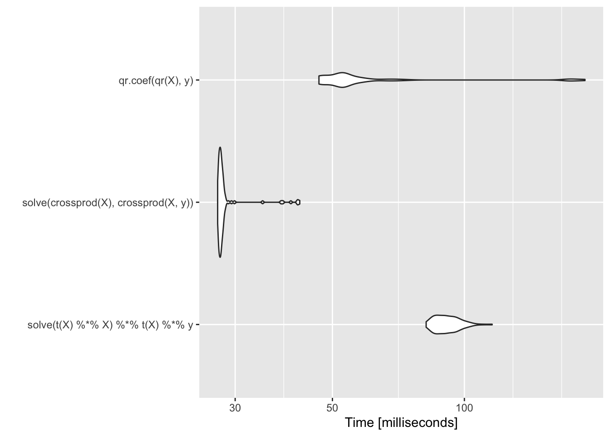

<!-- opt_linear_regression.md is generated from opt_linear_regression.Rmd. Please edit that file -->

# Notes of Optimization

## Notes of Linear Regression

The following notes are from this
[BOOK](https://bookdown.org/rdpeng/advstatcomp/textbooks-vs-computers.html).
Most of the original references become from there.

Pending,

-   Expand the **Guassian elimination** notes with an analytical example
    and an `R` code
-   Expand the **Gram-Schmidt process** notes with an analytical example
    and an `R` code.
-   [Check](https://csgillespie.github.io/efficientR/performance.html)

## Logarithms

Univariate normal distribution with mean *μ* and variance
*σ*<sup>2</sup> is

$f(x\|\\mu, \\sigma^2)=\\frac{1}{\\sqrt{2\\pi\\sigma}}e^{-\\frac{1}{2\\sigma^2}(x-\\mu)^2}$

and in `R` we can compute this value as

``` r
dnorm(0, mean=0, sd=1); dnorm(0)
#> [1] 0.3989423
#> [1] 0.3989423
```

Calculating the equation, we have

``` r
# Example 1
UniNorm <- function(x, mean=0, sigma=1){
  #pi = 3.14159
 output <- (1/sqrt(2*pi*sigma))*exp(-(1/2*(sigma)^2)*((x-mean)^2)) 
 print(output)
}
UniNorm(0)
dnorm(0)

# Example 2
UniNorm(1)
dnorm(1)
#> [1] 0.3989423
#> [1] 0.3989423
#> [1] 0.2419707
#> [1] 0.2419707
```

In practice, the exact number is not used, and the *l**o**g* is used
instead. However, in some cases we do need the value in the original
scale. Calculating *densities* with *l**o**g* is much more stable
because when the exponential function is used the number become very
small for the machine to represent (*underflow*), and if the ratio is
used we could have also big numbers (*overflow*). The *l**o**g* (and
then the *e**x**p*) resolve some of these issues.

## Linear Regression

We express the linear regression in matrix form as,

*y* = *X**β* + *ε*

Were *y* is a vector of size *n* × 1 of observed response, *X* is the
*n* × *p* predictor matrix, *β* is the *p* × 1 coefficient vector, and
*ε* is the *n* × 1 error vector.

To estimate *β* (via maximum likelihood or least square), is often
written in matrix form as

*β̂* = (*X*′*X*)<sup> − 1</sup>*X*′*y*

Which could be estimated in `R` using `solve` to extract the inverse of
the cross product matrix.

``` r
set.seed(1234)
X <- matrix(rnorm(5000 * 100), 5000, 100)
y <- rnorm(5000)
betahat <- solve(t(X) %*% X) %*% t(X) %*% y
head(betahat)
#>              [,1]
#> [1,]  0.013075906
#> [2,] -0.002368796
#> [3,] -0.007509733
#> [4,]  0.004884836
#> [5,]  0.011336186
#> [6,]  0.007056535
```

Computationally, this is very expensive!

<div class="alert alert-info">

Quick look of *inverse matrixes* to understand the following equation:
*β̂* = (*X*′*X*)<sup> − 1</sup>*X*′*y*

First, recall that not all square matrixes are inversible, and that
there are some properties of the inverse matrix such as:

1.  *A**A*<sup> − 1</sup> = *I* = *A*<sup> − 1</sup>*A*
2.  (*A**B*)<sup> − 1</sup> = *B*<sup> − 1</sup>*A*<sup> − 1</sup>
3.  (*A*<sup>*T*</sup>)<sup> − 1</sup> = (*A*<sup> − 1</sup>)<sup>*T*</sup>

Let use an example to disentangle some of the properties! First,

$$
A = 
\\begin{pmatrix}
a & b \\\\
c & d
\\end{pmatrix}
$$

and

$$
A^{-1} = 
\\begin{pmatrix}
x\_{1} & x\_{2} \\\\
y\_{1} & y\_{2}
\\end{pmatrix}
$$

we also know that

$$
I = 
\\begin{pmatrix}
1 & 0 \\\\
0 & 1
\\end{pmatrix}
$$

All together and considering (1) we have

$$
AA^{-1}=I=A^{-1}A=
\\begin{pmatrix}
a & b \\\\
c & d
\\end{pmatrix}
\\begin{pmatrix}
x\_{1} & x\_{2} \\\\
y\_{1} & y\_{2}
\\end{pmatrix} =
\\begin{pmatrix}
1 & 0 \\\\
0 & 1
\\end{pmatrix} =
\\begin{pmatrix}
x\_{1} & x\_{2} \\\\
y\_{1} & y\_{2}
\\end{pmatrix}
\\begin{pmatrix}
a & b \\\\
c & d
\\end{pmatrix}
$$

Now, solving the **linear system of equation** we have

1.  *a**x*<sub>1</sub> + *b**y*<sub>1</sub> = 1
2.  *a**x*<sub>2</sub> + *b**y*<sub>2</sub> = 0
3.  *c**x*<sub>1</sub> + *d**y*<sub>1</sub> = 0
4.  *c**x*<sub>2</sub> + *d**y*<sub>2</sub> = 1

Also, re-arranging some of the terms and doing some **elementary row
operations** we have for:

2.  *a**x*<sub>2</sub> + *b**y*<sub>2</sub> = 0

That,

$$
y\_{2}=\\frac{-a}{b}x\_{2}
$$

and

3.  *c**x*<sub>1</sub> + *d**y*<sub>1</sub> = 0

$$
y\_{1}=\\frac{-c}{d}x\_{1}
$$

Now,

1.  *a**x*<sub>1</sub> + *b**y*<sub>1</sub> = 1

we could replace some terms in such a way that,

$$
ax\_{1}-\\frac{bc}{d}x\_{1}=1
$$

and

$$
x\_{1}=\\frac{d}{ad-bc}
$$

then

$$
y\_{1}=\\frac{-c}{ad-bc}
$$

Also,

$$
\\frac{c}{b}x\_{2}-\\frac{ad}{b}x\_{2}=1
$$

is expressed as

$$
x\_{2}=\\frac{b}{bc-ad}
$$

and

$$
y\_{2}=\\frac{a}{ad-bc}
$$

Puting all together we have the inverse of the matrix

$$
A^{-1}= \\frac{1}{ad-bc}
\\begin{pmatrix}
d & -b \\\\
-c & a
\\end{pmatrix}
$$

And, considering that the determinant is,

$$
\|A\| = 
\\begin{vmatrix}
a & b \\\\
c & d
\\end{vmatrix} = 
ad-bc
$$

If the resulting value of *a**d* − *b**c* = 0, then the matrix is not
invertible (is singular or degenerate)

In `R` all this calculation is just a simple function. For example,

``` r
set.seed(1234)
X <- matrix(rnorm(100 * 100), 100, 100)
inv_X <- solve(X)
```

</div>

A better option that is less computationally demanding is re-arranging
the terms in the following way:

*X*′*X**β* = *X*′*y*

Which, gives the same result

``` r
set.seed(1234)
X <- matrix(rnorm(5000 * 100), 5000, 100)
betahat <- solve(crossprod(X), crossprod(X, y))
head(betahat)
#>              [,1]
#> [1,]  0.013075906
#> [2,] -0.002368796
#> [3,] -0.007509733
#> [4,]  0.004884836
#> [5,]  0.011336186
#> [6,]  0.007056535
```

### Gaussian elimination

The difference between computing the inverse of *X*′*X*, and using a
*Gaussian elimination* to compute *β̂* is that the solution is
numerically more stable and faster. Also, if there are high colinearity
amongst the predictors, then the results would be unstable if the
inverse in *X*′*X* is used.

<div class="alert alert-info">

**PENDING!!!! (check my algebra notebook)**

Quick look of **Guassian elimination** (or **row reduction**): algorithm
to solve linear equations.

The idea is to use **elementary row operations** and modify te matrix to
produce a “triangular” matrix with zeros in the bottom left corner
(achieving a **upper triangular matrix**), that is said to be in a
**reduced row echelon form**.

For example, we could try the **back substitution** in an augmented
matrix

**PENDING: edit the matrix R1(ccc\|c)**
$$
\\begin{array}{ccc\|c} 
1 & -1 & 5 & -9 \\\\ 
2 & -1 & -3 & -19 \\\\ 
3 & 1 & 4 & -13
\\end{array} 
$$

Consiering that we have three rows (*R*1, *R*2, *R*3)…

**I JUST ADD HERE A NICE MATRIX!!!:**

$$
A = 
  \\begin{matrix}\\begin{pmatrix}x & y\\end{pmatrix}\\\\\\mbox{}\\end{matrix}
  \\begin{pmatrix} a & b \\\\ c & d \\end{pmatrix} 
  \\begin{pmatrix} x \\\\ y \\end{pmatrix}
$$

[here](https://stackoverflow.com/questions/16044377/how-to-do-gaussian-elimination-in-r-do-not-use-solve)

``` r
# Data
A <- matrix(c(2,-5,4,1,-2.5,1,1,-4,6),byrow=T,nrow=3,ncol=3)
b <- matrix(c(-3,5,10),nrow=3,ncol=1)
p <- nrow(A)
(U.pls <- cbind(A,b))

# Gaussian Elimination
U.pls[1,] <- U.pls[1,]/U.pls[1,1]
i <- 2
while (i < p+1) {
 j <- i
 while (j < p+1) {
  U.pls[j, ] <- U.pls[j, ] - U.pls[i-1, ] * U.pls[j, i-1]
  j <- j+1
 }
 while (U.pls[i,i] == 0) {
  U.pls <- rbind(U.pls[-i,],U.pls[i,])
 }
 U.pls[i,] <- U.pls[i,]/U.pls[i,i]
 i <- i+1
}
for (i in p:2){
 for (j in i:2-1) {
  U.pls[j, ] <- U.pls[j, ] - U.pls[i, ] * U.pls[j, i]
 }
}
U.pls

# Check:
library(pracma)
rref(cbind(A, b))
#>      [,1] [,2] [,3] [,4]
#> [1,]    2 -5.0    4   -3
#> [2,]    1 -2.5    1    5
#> [3,]    1 -4.0    6   10
#>      [,1] [,2] [,3]  [,4]
#> [1,]    1    0    0 -51.0
#> [2,]    0    1    0 -25.0
#> [3,]    0    0    1  -6.5
#>      [,1] [,2] [,3]  [,4]
#> [1,]    1    0    0 -51.0
#> [2,]    0    1    0 -25.0
#> [3,]    0    0    1  -6.5
```

</div>

Comparing both strategies, we could check that the **Gaussian
elimination** in comparisson with the other strategy is less time
consuming

``` r
library(microbenchmark)
library(magrittr)
set.seed(1234)
X <- matrix(rnorm(5000 * 100), 5000, 100)
microbenchmark(
  inverse = solve(t(X) %*% X) %*% t(X) %*% y,
  gaussian = solve(crossprod(X), crossprod(X, y))
  ) %>% summary(unit = "ms") %>% knitr::kable(format = "markdown")
```

| expr     |      min |       lq |     mean |   median |       uq |       max | neval | cld |
|:---------|---------:|---------:|---------:|---------:|---------:|----------:|------:|:----|
| inverse  | 63.08678 | 69.75786 | 80.04667 | 77.43082 | 82.90803 | 171.18566 |   100 | b   |
| gaussian | 26.21987 | 27.28299 | 31.23538 | 30.02354 | 33.71449 |  56.39128 |   100 | a   |

On the other hand, the Gaussian elimination would breaks down when there
is collinearity in the *X* matrix. Meaning that the column *X* would be
very similar, but not identical, to the first column of *X*. For
example,

``` r
set.seed(127893)
X <- matrix(rnorm(5000 * 100), 5000, 100)
W <- cbind(X, X[, 1] + rnorm(5000, sd = 0.0000000001))
solve(crossprod(W), crossprod(W, y)) 
#> Error in solve.default(crossprod(W), crossprod(W, y)): system is computationally singular: reciprocal condition number = 1.47235e-16
```

In this case, the cross product matrix *W*′*W* is singular (determinant
is 0)

### QR decomposition

`R` use as a default the **QR decomposition**, that is not fast, but can
detect and handle colinear columns in the matrix.

<div class="alert alert-info">

Quick look of *orthogonal matrix* to understand the **QR decomposition**
(also known as **QR factorization** or **QU factorization**):
*A* = *Q**R*.

To work out with the orthogonal vector, we often work with
**orthonormal** vectors. That assumes that all the vectors have lenght 1
(\|\|*v*<sub>1</sub>\|\| = 1, \|\|*v*<sub>1</sub>\|\|<sup>2</sup> = 1 or
*v*<sub>1</sub>*v*<sub>2</sub> = 1 for *i*, 1, 2, ...*k*). Therefore,
they have all been “normalized” (unit vectors).

Two vectors *v*<sub>1</sub> and *v*<sub>2</sub>, are said to be
*orthogonal* if ⟨*v*<sub>1</sub>, *v*<sub>2</sub>⟩ = 0 (sometime
expressed as *v*<sub>1</sub> ⊥ *v*<sub>2</sub>)

A set of nonzero vectors that are mutually orthogonal are necessarily
linearly independent. Meaning that each vector in one is orthogonal to
every vector in the other, and said to be *normal* to that space
(*normal vector*).

[Example](https://www.khanacademy.org/math/linear-algebra/alternate-bases/orthonormal-basis/v/linear-algebra-introduction-to-orthonormal-bases):

Assuming that we have a vector

$$
v\_{1} = 
  \\begin{pmatrix} 1/3 \\\\ 2/3 \\\\ 2/3 \\end{pmatrix}
$$

and

$$
v\_{1} = 
  \\begin{pmatrix} 2/3 \\\\ 1/3 \\\\ -2/3 \\end{pmatrix}
$$

and *B* = {*v*<sub>1</sub>, *v*<sub>2</sub>}.

What is the lenght of *v*<sub>1</sub> and *v*<sub>2</sub>?

\|\|*v*<sub>1</sub>\|\|<sup>2</sup> = *v*<sub>1</sub>*v*<sub>2</sub> = 1/9 + 4/9 + 4/9 = 1
and \|\|*v*<sub>2</sub>\|\|<sup>2</sup> = 4/9 + 1/9 + 4/9 = 1. We know
that we have a normalized set *B*.

Are they orthogonal?
*v*<sub>1</sub>*v*<sub>2</sub> = 2/9 + 2/9 +  − 4/9 = 0

If we know that we have a space, such as
*V* = *s**p**a**n*(*v*<sub>1</sub>, *v*<sub>2</sub>), the we can say
that *B* is an ortohonormal basis for *V*.

We do know that the **QR decomposition** decompose a matrix *A* into a
product *A* = *Q**R* of an othogonal matrix *Q* and an upper triangular
matrix *R*.

</div>

<div class="alert alert-info">

Quick look of the [**Gram-Schmidt
process**](https://en.wikipedia.org/wiki/QR_decomposition) to compute
the **QR decomposition**.

**PENDING!!!! (check my algebra notebook)**

[check](https://genomicsclass.github.io/book/pages/qr_and_regression.html)

</div>

Knowing that *X* can be decomposed as *X* = *Q**R*, the linear
regression

*X*′*X**β* = *X*′*y*

can be writted as

$$
R'Q'QR'\\beta = R'Q'y \\\\
R'R\\beta = R'Q'y \\\\
R\\beta = Q'y
$$

Considering that *Q*′*Q* = *I*, now we have a simpler equation that does
not longer require to compute the cross product. Also, due the QR
decomposition *R* is upper triangular and, therefore, we can solve *β*
via Gaussian elimination. Some of the benefits are that the cross
product *X*′*X* was numerically unstable if it is not properly centered
or scaled.

To compute the singular matrix *W* of the example, the QR decomposition
continous without error. Notices that the ouput have 100 and not 101
ranks, this is because the colinear column.

``` r
Qw <- qr(W)
str(Qw)
#> List of 4
#>  $ qr   : num [1:5000, 1:101] -7.04e+01 -1.15e-02 -8.27e-05 6.89e-03 -1.13e-02 ...
#>  $ rank : int 100
#>  $ qraux: num [1:101] 1.03 1.01 1.03 1.01 1.02 ...
#>  $ pivot: int [1:101] 1 2 3 4 5 6 7 8 9 10 ...
#>  - attr(*, "class")= chr "qr"
```

After understanding the QR decomposition for the matrix, we can now
solve the regression equation to estimate *β̂* using `R`:

``` r
betahat <- qr.coef(Qw, y)
tail(betahat, 1)
#> [1] NA
```

Notices that the last element in the position 101 is `NA` due the
colliniarity. Meaning that the coefficient could not be calculated.

This approach helps with colliniarity, is better and more stable.
However, is slower:

``` r
library(ggplot2)
library(microbenchmark)
m <- microbenchmark(solve(t(X) %*% X) %*% t(X) %*% y,
                    solve(crossprod(X), crossprod(X, y)),
                    qr.coef(qr(X), y))
autoplot(m)
```



## Multivariate Normal Distribution

The *p*-dimensional multivariate Normal density is written as
$$
\\begin{aligned}
\\varphi(x\|\\mu, \\Sigma)=-\\frac{p}{2}log\|\\Sigma\|-\\frac{1}{2}(x-\\mu)'\\Sigma ^{ -1}(x-\\mu)
\\end{aligned}
$$

<div class="alert alert-info">

Quick look of the **multivariate Normal density**.

Considering that the Gaussian or normal distribution for the univariate
case is
$f(x\|\\mu, \\sigma^2)=\\frac{1}{\\sqrt{2\\pi\\sigma}}e^{-\\frac{1}{2\\sigma^2}(x-\\mu)^2}$

With parameters: mean *μ* and variance *σ*<sup>2</sup> (standard
deviation *σ*). We know that the maximum likelihood estimates are
$$
\\begin{aligned}
\\hat{\\mu}=\\frac{1}{N}\\sum\_{i}x^{(i)} \\\\
\\hat{\\sigma}^{2}=\\frac{1}{N}\\sum\_{i}(x^{(i)}-\\hat{\\mu})^{2}
\\end{aligned}
$$

Then, we have the multivariate Normal density which is the extension of
this model to vector value random variables in a multidimensional space.
In which *x* would be a vector with *d* values, with *μ* as the length-d
row vector, and *Σ* a *d* × *d* matrix.Remember that \|*Σ*\| is the
determinant matrix of the covariants,

The maximum likelihood are similar to the univariate case
$$
\\begin{aligned}
\\hat{\\mu}=\\frac{1}{m}\\sum\_{j}x^{(j)} \\\\
\\hat{\\Sigma}^{2}=\\frac{1}{m}\\sum\_{j}(x^{(j)}-\\hat{\\mu})^{T}(x^{(j)}-\\hat{\\mu})
\\end{aligned}
$$
Where *Σ* is the average of the *d* × *d* matrix (outer product).

For [example](https://www.youtube.com/watch?v=eho8xH3E6mE),

If we have two independent Gaussian variables *x*<sub>1</sub> and
*x*<sub>2</sub>, normalized with a *Z* constant
$$
\\begin{aligned}
p(x\_{1})=\\frac{1}{Z\_{1}}exp\\{-\\frac{1}{2\\sigma^{2}\_{1}}(x\_{1}-\\mu\_{1})^{2}\\} \\\\
p(x\_{2})=\\frac{1}{Z\_{2}}exp\\{-\\frac{1}{2\\sigma^{2}\_{2}}(x\_{2}-\\mu\_{2})^{2}\\}
\\end{aligned}
$$
We can a new vector concatenating the two vectors,
*x* = \[*x*<sub>1</sub>*x*<sub>2</sub>\] we can ask for the distribution
of *x* assuming that *x*<sub>1</sub> and *x*<sub>2</sub> are
independents. Then, the joint distribution is the product of the
individual distributions. Then, we have
$$
p(x\_{1})p(x\_{2})=\\frac{1}{Z\_{1}Z\_{2}}exp\\{-\\frac{1}{2}\\}(x-\\mu)^{T}\\Sigma^{-1}(x-\\mu) \\\\
\\mu=\[\\mu\_{1}\\mu\_{2}\] \\\\
\\Sigma = diag(\\sigma^{2}\_{1}, \\sigma^{2}\_{2}) \\\\
\\Sigma=\\begin{pmatrix} \\sigma^{2}\_{11} & 0 \\\\ 0 & \\sigma^{2}\_{22} \\end{pmatrix}
$$

</div>

From the multivariate Normal density equation, the most time-consuming
part is the quadratic form
$$
(x-\\mu)'\\Sigma^{-1}(x-\\mu) = z'\\Sigma^{-1}z \\\\
z=x-\\mu
$$

Similarly to the regression example above is the inversion of the of the
*p*-dimensional covariance matrix *Σ*. Taking *z* as a *p* × 1 column
vector, then in `R` this could be expressed as

``` r
t(z) %*% solve(Sigma) %*% z
```

### Choleskey decomposition

Rather than using the literal equation, a similar approach is using the
**Choleskey decomposition** of *Σ*.

<div class="alert alert-info">

Quick look of the **Choleskey decomposition** or **Choleskey
factorization**.

[here](https://www.maths.manchester.ac.uk/~higham/papers/high09c.pdf)
Recall that if all the eigenvalues of *A* are positive, or if
*x*<sup>*T*</sup>*A**x* is positive for all non-zero vector *x* (which
is equivalent), then we assume that a symmetric *n* × *n* matrix *A* is
**positive definite**. If a matrix is **positive definite**, then it
could be defined as *A* = *X*′*X* for a non-singular (non-invertible)
matrix *X*.

**PENDING!!!! (check my algebra notebook)**

[check](http://www.seas.ucla.edu/~vandenbe/133A/lectures/chol.pdf)

</div>

<div class="alert alert-info">

Quick look of the **eigenvalues**.

**PENDING!!!! (check my algebra notebook)**

</div>

Using the Choleskey decomposition for a positive definite matrix on *Σ*,
we have
*Σ* = *R*′*R*
were *R* is an upper triangular matrix (also called the *square root* of
*Σ*). Using Choleskey decomposition on *Σ* and the rules of matrix
algebra, the multivariate Normal density equation can be written as
$$
z'\\Sigma^{-1}z = z'(R'R)^{-1}z \\\\
= z'R^{-1}R'^{-1}z \\\\
= (R'^{-1}z)'R'^{-1}z \\\\
= v'v
$$
Where *v* = *R*′<sup> − 1</sup>*z* and is a *p* × 1 vector. Also, to
avoid inverting *R*′<sup> − 1</sup> by computing *v* as solution of the
linear system
*R*′*v* = *z*
Then, computing *v*, we can compute *v*′*v*, which is simply the
cross-product of two *p*-dimensional vectors.

One of the benefits of using Choleskey decomposition is that gives a way
of computing the log-determinant of *Σ*. Where the log-determinant of
*Σ* is simply 2 times the sum of the log of the diagional elements of
*R*. Implementing this in a function

``` r
set.seed(93287)
z <- matrix(rnorm(200 * 100), 200, 100)
S <- cov(z)
quad.naive <- function(z, S) {
        Sinv <- solve(S)
        rowSums((z %*% Sinv) * z)
}
library(dplyr)
quad.naive(z, S) %>% summary
#>    Min. 1st Qu.  Median    Mean 3rd Qu.    Max. 
#>   76.78   93.31   99.78  100.34  107.33  129.04
```

Now, a version that use the Choleskey decomposition

``` r
quad.chol <- function(z, S) {
        R <- chol(S)
        v <- backsolve(R, t(z), transpose = TRUE)
        colSums(v * v)
}
quad.chol(z, S) %>% summary
#>    Min. 1st Qu.  Median    Mean 3rd Qu.    Max. 
#>   76.78   93.31   99.78  100.34  107.33  129.04
```

Comparing both approaches

``` r
library(microbenchmark)
microbenchmark(quad.naive(z, S), quad.chol(z, S))
#> Unit: milliseconds
#>              expr      min       lq     mean   median       uq      max neval
#>  quad.naive(z, S) 2.003345 2.152709 2.659539 2.542245 2.835138 8.946027   100
#>   quad.chol(z, S) 1.111796 1.297664 1.471002 1.413560 1.540808 4.731252   100
#>  cld
#>    b
#>   a
```

The Choelsky decomposition is faster. Also, because **we know** that the
covariance matrix in a multivariate Normal is symmetric and positive
define we can use the Choleskey decomposition. The naive version does
not have that information, therefore, inverte the matrix and takes more
time to estimate!
